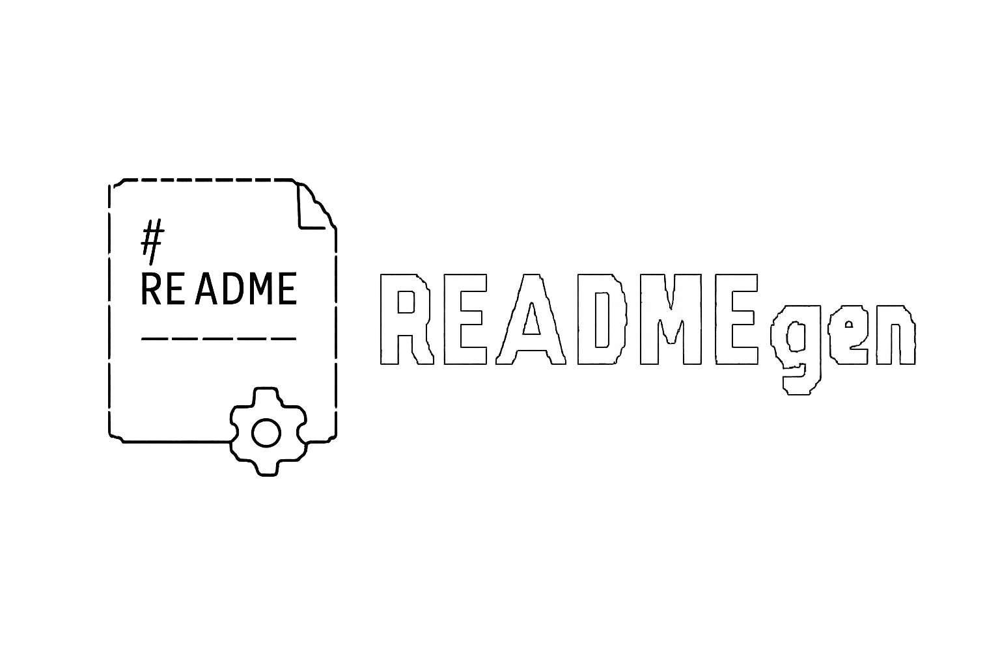

# READMEgen
[](https://github.com/Infrastrukturait/READMEgen/releases)
[](https://github.com/Infrastrukturait/READMEgen/releases)


## About

READMEgen is a small README generation standard based on `gomplate`.

It provides a reusable `README.md.template`, a simple `readmegen` CLI helper, and a GitHub Actions workflow for keeping generated README files up to date across repositories.


## Features

- Standardized README generation
- JSON and YAML configuration support
- Optional markdown includes
- Built-in license sections
- Local and remote template support
- CLI helper for local usage, hooks, and CI
- Reusable GitHub Actions workflow for scheduled README regeneration


## Documentation

- [Usage](docs/usage.md)
- [Requirements](docs/requirements.md)
- [Configuration](docs/vars.md)
- [GitHub Actions workflow example](docs/workflow-example.md)


## License
[](https://www.gnu.org/licenses/gpl-3.0)

```text
GNU GENERAL PUBLIC LICENSE
Version 3, 29 June 2007

This program is free software: you can redistribute it and/or modify it
under the terms of the GNU General Public License as published by the
Free Software Foundation, either version 3 of the License, or at your option
any later version.

This program is distributed in the hope that it will be useful,
but WITHOUT ANY WARRANTY.

Source: https://opensource.org/license/gpl-3-0/
```
## Authors

- Rafał Masiarek | [website](https://masiarek.pl) | [email](mailto:rafal@masiarek.pl) | [github](https://github.com/rafalmasiarek)


<!-- references -->

[repo_link]: https://github.com/Infrastrukturait/READMEgen
[1]: https://gomplate.ca
[2]: https://github.com/hairyhenderson/gomplate
[3]: https://github.com/Infrastrukturait/READMEgen/releases

